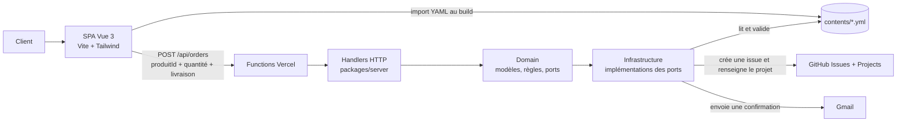
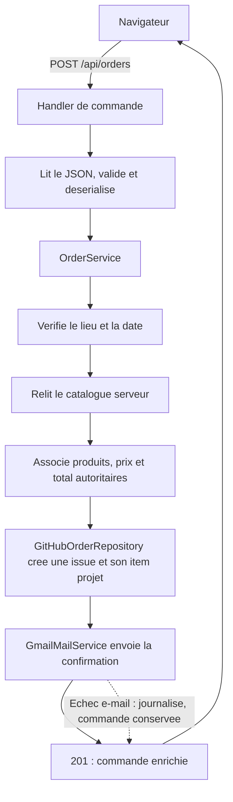

# Architecture de Cookids

## Objectif et périmètre

Cookids est une boutique de pâtisseries solidaires. L'application permet de consulter le catalogue mensuel, composer un panier et soumettre une commande. Son principe de sécurité central est le suivant : le navigateur n'envoie que les identifiants de produits et les quantités ; le serveur relit le catalogue et recalcule les montants avant tout enregistrement.

Le dépôt est un monorepo TypeScript géré avec pnpm. Il réunit une SPA Vue, des fonctions HTTP Vercel et les bibliothèques de domaine et d'infrastructure partagées.

## Vue d'ensemble

## Découpage du dépôt

| Emplacement                | Responsabilité                                                                                                          | Dépendances autorisées principales                                                           |
|----------------------------|-------------------------------------------------------------------------------------------------------------------------|----------------------------------------------------------------------------------------------|
| `contents/`                | Sources métier éditables : catalogue, textes du site, lieux/dates de livraison et configuration du tableau GitHub.      | Aucune dépendance de code.                                                                   |
| `packages/domain/`         | Modèles, DTO, schémas Ts.ED, règles métier et ports abstraits.                                                          | Pas de dépendance à Vercel, GitHub, Gmail ou au navigateur.                                  |
| `packages/infrastructure/` | Adaptateurs techniques, chargement/validation YAML, configuration de l'injection de dépendances et couche HTTP commune. | `domain`, Node.js et SDKs externes.                                                          |
| `packages/server/`         | Handlers applicatifs : extraction HTTP, validation, désérialisation et appel des services métier.                       | `domain` et `infrastructure`.                                                                |
| `api/`                     | Adaptateurs fins exigés par Vercel ; expose les handlers sous `/api`.                                                   | `packages/server`.                                                                           |
| `packages/web/`            | SPA Vue 3 : catalogue, panier, tunnel de commande et appel de l'API.                                                    | Modèles/schémas de contenu du `domain`, jamais les secrets ni le calcul autoritaire de prix. |

Cette direction de dépendances maintient le domaine indépendant de l'hébergement et des fournisseurs externes. Un changement de stockage des commandes ou de messagerie consiste donc à remplacer un adaptateur d'infrastructure derrière un port, sans modifier la règle de calcul de commande.

## Sources de contenu

Les fichiers YAML sont les seules sources éditables de contenu métier :

| Fichier                  | Contenu                                                               | Consommateurs                                 |
|--------------------------|-----------------------------------------------------------------------|-----------------------------------------------|
| `contents/catalog.yml`   | Produits, prix, unités, descriptions et références d'images.          | SPA et serveur.                               |
| `contents/site.yml`      | Textes de la vitrine.                                                 | SPA et serveur via le fournisseur de contenu. |
| `contents/locations.yml` | Lieux et, le cas échéant, dates de livraison fixes.                   | SPA et serveur.                               |
| `contents/boards.yml`    | Paramètres structurels du dépôt/projet GitHub recevant les commandes. | Infrastructure côté serveur.                  |

La SPA importe les YAML avec le plugin Vite et les valide avant usage. Côté serveur, les fournisseurs Node lisent les mêmes fichiers, les parsencent puis les valident avec les schémas fonctionnels Ts.ED/AJV. Les images détenues par le projet résident dans `packages/web/public/images/` et sont référencées par le catalogue ; aucun composant ne duplique les données du YAML.

## Flux de commande

Le handler `packages/server/handlers/orders/handler.ts` porte la frontière HTTP : il lit le JSON, le valide avec le groupe `create`, le désérialise avec `useAlias: false`, puis passe un modèle `Order` à `OrderService`. Le service ne relit ni ne remappe l'entrée HTTP : il applique les règles de disponibilité, résout les produits depuis le catalogue de confiance et appelle les ports `OrderRepository` et `MailService`.

Un produit, prix ou total fourni par le navigateur n'est donc jamais une valeur de référence. Une erreur de validation, un produit inconnu ou un lieu/date invalide devient une réponse HTTP contrôlée par `defineFetchHandler` et `createErrorResponse`.

## Ports et adaptateurs

Le domaine dépend d'abstractions :

- `CatalogProvider` fournit les produits autoritaires.
- `DeliveryLocationProvider` fournit les lieux et leurs contraintes de dates.
- `OrderRepository` persiste une commande et retourne son identifiant.
- `MailService` envoie la confirmation au client.

L'assemblage est visible dans `packages/infrastructure/config/index.ts`, via l'injecteur Ts.ED : `NodeCatalogProvider` et `NodeDeliveryLocationProvider` lisent les YAML, `GitHubOrderRepository` crée une issue et configure son item GitHub Project, et `GmailMailService` expédie la confirmation. Avec `NODE_ENV=test`, les ports de persistance et de messagerie sont remplacés par `FakeOrderRepository` et `FakeMailService` afin d'isoler les tests.

## Exposition HTTP et déploiement

`api/orders.ts` et `api/health.ts` sont les entrées Vercel. Elles délèguent respectivement aux handlers de commande et de santé dans `packages/server`. `defineFetchHandler` initialise l'injection de dépendances, crée un contexte par requête avec un identifiant de corrélation, applique la méthode HTTP attendue et centralise la conversion des exceptions ainsi que la journalisation.

La configuration Vercel construit la SPA dans `packages/web/dist` et inclut les YAML dans la fonction de commande. Le déploiement est déclenché depuis `main`.

## Configuration, secrets et observabilité

Les variables d'environnement sont chargées localement par `dotenv-flow`; en production, elles sont fournies par Vercel. Les secrets ne doivent jamais être préfixés par `VITE_`, car ce préfixe les rend accessibles au navigateur.

Les intégrations de production attendent notamment `GITHUB_TOKEN`, `GMAIL_USER` et `GMAIL_APP_PASSWORD`. La configuration non secrète du tableau GitHub est maintenue dans `contents/boards.yml`. Les événements de traitement de commande et les erreurs de configuration sont journalisés avec le contexte de requête.

## Qualité et règles d'évolution

- Les tests sont co-localisés ; les doubles Ts.ED passent par `DITest.invoke()`.
- Les modèles et schémas Ts.ED sont compilés et couverts par des instantanés de schéma.
- Toute évolution fonctionnelle doit préserver le recalcul serveur des prix et exécuter `pnpm run test` puis `pnpm run build`.
- Les adaptateurs externes doivent rester derrière les ports du domaine ; une intégration nouvelle ne doit pas se propager dans les composants Vue ni dans les modèles métier.
- La couche web privilégie les utilitaires Tailwind et le composant partagé `AppButton` pour les boutons.
